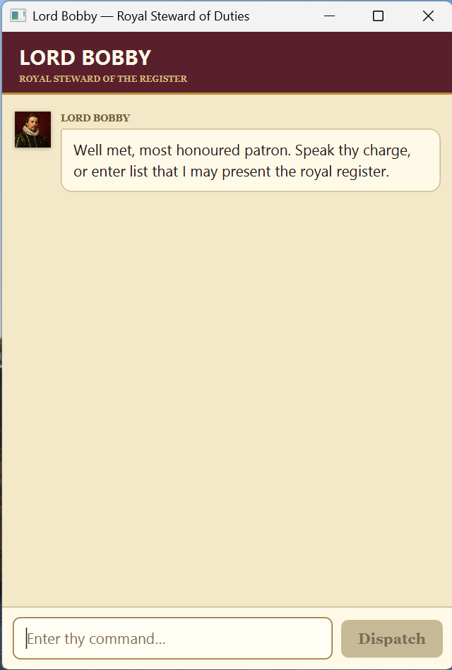

# Lord Bobby User Guide

**Chatbot name: Lord Bobby**

Lord Bobby is a desktop chatbot that keeps track of your to-dos, deadlines, and events. Type a command and press <kbd>Enter</kbd>, or select **Dispatch**, to receive a response.



## Quick start

1. Ensure that [Java 25](https://www.oracle.com/java/technologies/downloads/#java25) is installed.
1. Place the supplied `bobby.jar` file in the folder where you want Bobby to keep its data.
1. Open a terminal in that folder and run:

   ```shell
   java -jar bobby.jar
   ```

1. Enter a command in the box at the bottom of the window. Try `todo read a book`, followed by `list`.

Bobby automatically saves changes to `data/bobby.txt` in the folder from which you launched the app.

## Command format

- Words in `UPPER_CASE` are values that you supply. For example, replace `DESCRIPTION` with `read a book`.
- Enter dates and times as `YYYY-MM-DD HHMM` using the 24-hour clock. For example, `2026-09-20 1830` means 20 September 2026 at 6:30 PM.
- Command words and date-time prefixes such as `/by` are not case-sensitive.
- A description must contain readable text and cannot contain `|`.
- Bobby rejects duplicate tasks with the same type and details, even if their capitalization or spacing differs.

## Features

### Adding a to-do: `todo`

Adds a task without a date or time.

Format: `todo DESCRIPTION`

Example: `todo read a book`

### Adding a deadline: `deadline`

Adds a task that must be completed by a specific date and time.

Format: `deadline DESCRIPTION /by YYYY-MM-DD HHMM`

Example: `deadline submit report /by 2026-09-20 2359`

### Adding an event: `event`

Adds an event with a start and end. The start must be earlier than the end.

Format: `event DESCRIPTION /from YYYY-MM-DD HHMM /to YYYY-MM-DD HHMM`

Example: `event project meeting /from 2026-09-21 1400 /to 2026-09-21 1600`

### Viewing all tasks: `list`

Shows every task in the order it was added. Each task has a number, a type (`T`, `D`, or `E`), and a status (`X` for completed or a blank for pending).

Format: `list`

Example output:

```text
1.[T][ ] read a book
2.[D][X] submit report (appointed for: Sep 20 2026 11:59 PM)
```

### Finding tasks: `find`

Shows tasks whose descriptions contain the given word or phrase. Matching is not case-sensitive.

Format: `find KEYWORD_OR_PHRASE`

Example: `find report`

> **Important:** The numbers in search results are result positions, not necessarily the tasks' numbers in the full list. Run `list` and use the number shown there before marking, unmarking, or deleting a task.

### Marking a task as completed: `mark`

Marks a task as completed. Use the positive whole-number task number shown by `list`.

Format: `mark TASK_NUMBER`

Example: `mark 2`

### Marking a task as pending: `unmark`

Changes a completed task back to pending.

Format: `unmark TASK_NUMBER`

Example: `unmark 2`

### Deleting a task: `delete`

Permanently removes a task from the list.

Format: `delete TASK_NUMBER`

Example: `delete 1`

### Viewing task statistics: `stats`

Shows the current Monday-to-Sunday period and counts of tasks completed during that week, completed overall, pending, and total. The command lists counts only, not task descriptions.

Format: `stats`

Tasks completed in the current week count from the moment you mark them. A task that you unmark or delete no longer counts as completed. Older completed tasks whose completion time is unavailable still count toward the overall total, but not the current week.

### Exiting Bobby: `bye`

Closes Bobby after displaying a farewell.

Format: `bye`

## Data and backups

Bobby saves after every command that changes the task list. When you next launch Bobby from the same folder, your tasks are restored automatically.

To back up or move your tasks, close Bobby and copy the `data/bobby.txt` file. Avoid editing it manually: if Bobby cannot read the file, it starts with an empty task list and displays an error.

## Command summary

| Action | Command | Example |
| --- | --- | --- |
| Add a to-do | `todo DESCRIPTION` | `todo read a book` |
| Add a deadline | `deadline DESCRIPTION /by YYYY-MM-DD HHMM` | `deadline submit report /by 2026-09-20 2359` |
| Add an event | `event DESCRIPTION /from YYYY-MM-DD HHMM /to YYYY-MM-DD HHMM` | `event meeting /from 2026-09-21 1400 /to 2026-09-21 1600` |
| View all tasks | `list` | `list` |
| Find tasks | `find KEYWORD_OR_PHRASE` | `find report` |
| Mark as completed | `mark TASK_NUMBER` | `mark 2` |
| Mark as pending | `unmark TASK_NUMBER` | `unmark 2` |
| Delete a task | `delete TASK_NUMBER` | `delete 1` |
| View statistics | `stats` | `stats` |
| Exit Bobby | `bye` | `bye` |
